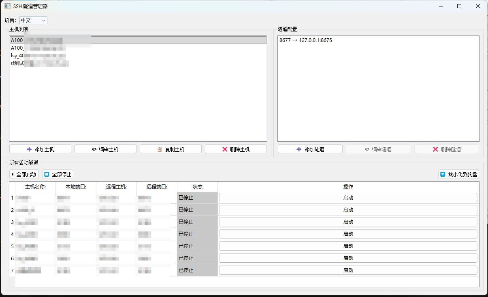

# SSH 隧道管理器 / SSH Tunnel Manager

一个免费、开源、方便的SSH隧道管理工具，支持图形化界面管理多个SSH端口转发隧道，一键启停，保存主机密钥和配置，缩小到系统托盘，不影响其他界面操作。特别适合一些使用docker、Podman、Containerd、Kubernetes等容器服务器，想把容器中的网页/程序/工具的端口映射到本地的用户们。

[最新下载(windows版本)](https://github.com/GuardSkill/SSH-Tunnel-Manager/releases)

[v1老版本下载(只支持密钥登陆)(windows版本)](https://github.com/GuardSkill/SSH-Tunnel-Manager/releases/download/v1.0/SSHTunnelManager.exe)

<a href="#-支持开发者--support-the-developer"> 
  
</a>
<a href="#-支持开发者--support-the-developer">
  
</a>



## 🚩 核心特性

- 🌐 **多主机管理** - 保存并切换任意数量的 SSH 服务器配置，支持一键复制
- 🔌 **多隧道端口映射** - 本地 ⇄ 远程端口，批量维护更高效
- 📊 **全局可视化** - 三区域布局，一屏掌握所有主机与隧道状态
- 🔄 **批量操作** - “全部启动 / 全部停止” 同时支持主界面和托盘菜单
- ♻️ **自动重连与健康监测** - 断线自动恢复，定时巡检守护隧道稳定
- ⚡ **无阻塞启动队列** - 批量启动后台排队执行，界面流畅不卡顿
- 🔗 **端口快捷访问** - 运行中的本地端口呈按钮化，单击即打开浏览器
- 💾 **配置持久化** - 全部信息写入 `~/.ssh_tunnel_manager_v2.json`
- 🌍 **中英双语** - 支持中文/English 即时切换
- 🔒 **多重认证** - 密码、密钥、默认密钥目录自动识别
- 📌 **系统托盘集成** - 自绘科技感图标、双击置顶、右键快速操作
- 🎯 **纯 Python 实现** - Paramiko + PyQt5，无需依赖外部 SSH 客户端

## 🆕 V2.2 版本亮点

- 🧠 **自动重连升级**：隧道断开后自动恢复，状态实时回写 UI
- 🧵 **异步启动队列**：批量启动分批创建线程，避免界面冻结
- 🖱️ **本地端口按钮化**：活动表格内点击端口即可访问 `http://127.0.0.1:port/`
- 🛎️ **托盘菜单增强**：新增全部启动/停止、显示窗口自动置顶、焕新图标
- 📈 **刷新调度器**：合并频繁刷新请求，减少不必要的 UI 重绘

## 🆕 V2.0 版本更新

### 重大改进
- ✅ **全新UI布局** - 三区域设计，左上主机列表、右上隧道配置、底部全局活动隧道
- ✅ **Paramiko实现** - 不再依赖系统SSH客户端，纯Python实现更稳定
- ✅ **主机复制功能** - 快速复制主机配置，方便创建相似服务器
- ✅ **数据持久化优化** - 彻底解决切换主机后隧道配置丢失的问题
- ✅ **Windows密钥支持** - 自动检测 `%USERPROFILE%\.ssh\` 目录下的密钥
- ✅ **性能大幅提升** - 启动加载速度提升30-40倍
- ✅ **全局隧道视图** - 一屏查看所有主机的所有隧道状态

### UI改进
```
┌─────────────────────────────────────────────┐
│          顶部：语言选择                       │
├──────────────┬──────────────────────────────┤
│              │                              │
│  左上：      │   右上：                      │
│  主机列表    │   隧道配置列表                 │
│              │   (当前选中主机的隧道)         │
│              │                              │
├──────────────┴──────────────────────────────┤
│                                             │
│          下部：所有活动隧道                   │
│          (显示所有主机的所有隧道)             │
│          [▶️ 全部启动] [⏹️ 全部停止]         │
│                                             │
└─────────────────────────────────────────────┘
```

## 📋 系统要求

- Python 3.7+
- PyQt5
- Paramiko

### 支持的操作系统
- ✅ Windows 10/11
- ✅ Linux
- ✅ macOS

## 🚀 快速开始

### 安装依赖

```bash
pip install PyQt5 paramiko
```

或使用 requirements.txt：

```bash
pip install -r requirements.txt
```

### 运行程序

```bash
python ssh_tunnel_manager_v2.py
```

## 📦 打包成独立可执行文件

### 方法一：使用 PyInstaller（推荐）

1. **安装 PyInstaller**
```bash
pip install pyinstaller
```

2. **执行打包**
```bash
# Windows
pyinstaller --name="SSHTunnelManager" ^
            --windowed ^
            --onefile ^
            --icon=icon.ico ^
            ssh_tunnel_manager_v2.py

# Linux/macOS
pyinstaller --name="SSHTunnelManager" \
            --windowed \
            --onefile \
            ssh_tunnel_manager_v2.py
```

3. **查找生成的可执行文件**
   - Windows: `dist/SSHTunnelManager.exe`
   - Linux: `dist/SSHTunnelManager`
   - macOS: `dist/SSHTunnelManager.app`

### 打包参数说明
- `--name`: 指定生成的可执行文件名称
- `--windowed`: 不显示控制台窗口（GUI应用必需）
- `--onefile`: 打包成单个可执行文件
- `--icon`: 指定应用图标（可选）
- `--clean`: 清理临时文件
- `--noconsole`: Windows下隐藏控制台（等同于--windowed）

## 📖 使用指南

### 1. 首次运行

首次运行时，程序会自动加载所有已保存的主机和隧道配置，无需任何额外设置。

### 2. 配置服务器

#### 添加新主机

1. 点击左下方的 "➕ 添加主机" 按钮
2. 在弹出的对话框中填写：
   - **主机名称**：给服务器起一个便于识别的名字
   - **服务器IP**：SSH服务器地址
   - **SSH端口**：默认22
   - **用户名**：SSH登录用户名
   - **认证方式**：
     - **密码认证**：直接填写密码
     - **SSH密钥**：选择密钥文件或留空使用默认密钥

3. 点击"保存"

#### 复制已有主机

1. 在左侧主机列表选中要复制的主机
2. 点击 "📋 复制主机" 按钮
3. 修改主机名称和需要更改的配置
4. 保存即可创建一个新主机（隧道配置也会被复制）

**使用场景**：
- 创建多个相似配置的服务器（只需修改IP）
- 测试环境和生产环境（配置相同，只是地址不同）
- 主备服务器配置

### 3. SSH密钥认证

#### Windows用户

程序会自动检测以下位置的密钥：
```
C:\Users\你的用户名\.ssh\id_rsa
C:\Users\你的用户名\.ssh\id_dsa
C:\Users\你的用户名\.ssh\id_ecdsa
C:\Users\你的用户名\.ssh\id_ed25519
```

**生成SSH密钥**（如果还没有）：
```powershell
# 打开 PowerShell
ssh-keygen -t rsa -b 4096 -C "your_email@example.com"
```

**查看公钥**（需要上传到服务器）：
```powershell
type $env:USERPROFILE\.ssh\id_rsa.pub
```

#### Linux/Mac用户

程序会自动检测 `~/.ssh/` 目录下的默认密钥。

**生成SSH密钥**：
```bash
ssh-keygen -t rsa -b 4096
```

**上传公钥到服务器**：
```bash
ssh-copy-id username@server_ip
```

#### 使用自定义密钥

如果密钥在其他位置：
1. 选择"使用SSH密钥"
2. 点击"浏览"选择密钥文件
3. 或手动输入完整路径

### 4. 添加端口映射

1. 在左侧主机列表**选中一个主机**
2. 点击右上方的 "➕ 添加隧道" 按钮
3. 填写隧道配置：
   - **本地端口**：本地监听端口（如 8080）
   - **远程主机**：目标主机地址（默认 127.0.0.1）
   - **远程端口**：目标端口（如 80）

4. 点击"保存"

**示例配置**：
```
场景 1：访问远程MySQL
- 本地端口：3306
- 远程主机：127.0.0.1
- 远程端口：3306
→ 访问 localhost:3306 连接到远程MySQL

场景 2：访问内网Web服务
- 本地端口：8080
- 远程主机：192.168.1.100
- 远程端口：80
→ 访问 http://localhost:8080 访问内网服务器
```

### 5. 启动隧道

#### 单个隧道
在底部"所有活动隧道"表格中，找到要启动的隧道，点击"启动"按钮

#### 批量启动
点击 "▶️ 全部启动" 按钮，启动所有主机的所有隧道

#### 停止隧道
- **单个**：点击对应行的"停止"按钮
- **全部**：点击 "⏹️ 全部停止" 按钮

### 6. 管理配置

#### 编辑主机
1. 选中主机
2. 点击 "✏️ 编辑主机"
3. 修改配置并保存

#### 编辑隧道
1. 选中主机
2. 在右上方隧道配置列表选中要编辑的隧道
3. 点击 "✏️ 编辑隧道"
4. 修改配置并保存

#### 删除配置
- **删除主机**：选中后点击 "❌ 删除主机"（会同时删除所有隧道）
- **删除隧道**：选中隧道后点击 "❌ 删除隧道"

### 7. 系统托盘功能

点击 "🔽 最小化到托盘" 后，程序会在后台运行：
- 📋 显示窗口：恢复主窗口
- 🚪 退出：停止所有隧道并完全关闭程序

## 🔧 高级功能

### 全局视图

底部的"所有活动隧道"表格显示：
- 所有主机的所有隧道配置
- 实时运行状态（已停止/启动中/运行中）
- 每个隧道独立的启动/停止按钮

**优势**：
- ✅ 一屏查看所有隧道
- ✅ 无需切换主机即可操作
- ✅ 快速定位运行中的隧道

### 多语言切换
在界面顶部选择语言：中文 / English

### 配置文件位置
- 配置文件：`~/.ssh_tunnel_manager_v2.json`

配置文件包含：
- 所有主机信息
- 每个主机的隧道配置
- 语言设置

## 🛠️ 故障排除

### 连接失败

**问题**：提示"连接服务器失败"

**解决方案**：
1. 检查服务器IP、端口、用户名是否正确
2. 验证认证方式：
   - 密码认证：确保密码正确
   - 密钥认证：确保公钥已添加到服务器的 `~/.ssh/authorized_keys`
3. 检查网络连接
4. 确认服务器SSH服务正常运行

### 密钥认证失败

**问题**：使用密钥时连接失败

**Windows解决方案**：
```powershell
# 检查密钥是否存在
dir $env:USERPROFILE\.ssh\

# 查看公钥内容
type $env:USERPROFILE\.ssh\id_rsa.pub

# 将公钥添加到服务器
# 登录服务器后执行：
# echo "公钥内容" >> ~/.ssh/authorized_keys
# chmod 600 ~/.ssh/authorized_keys
```

**Linux/Mac解决方案**：
```bash
# 检查密钥权限
ls -la ~/.ssh/

# 设置正确权限
chmod 700 ~/.ssh
chmod 600 ~/.ssh/id_rsa
chmod 644 ~/.ssh/id_rsa.pub

# 上传公钥
ssh-copy-id username@server_ip
```

### 端口已被占用

**问题**：隧道无法启动，提示端口被占用

**解决方案**：
1. 更换本地端口号
2. 或查找并关闭占用该端口的程序：

**Windows**：
```powershell
# 查找占用端口的程序
netstat -ano | findstr :8080
# 根据PID关闭程序
taskkill /PID <进程ID> /F
```

**Linux/Mac**：
```bash
# 查找占用端口的程序
lsof -i :8080
# 关闭程序
kill -9 <PID>
```

### 隧道意外断开

**问题**：运行中的隧道变为"已停止"

**解决方案**：
1. 检查网络连接是否稳定
2. 验证服务器SSH服务是否正常
3. 检查服务器防火墙设置
4. 重新启动隧道

### 切换主机后隧道消失

**问题**：V1.0版本可能出现此问题

**解决方案**：
- ✅ V2.0已完全修复此问题
- 升级到V2.0版本
- 所有隧道会持久显示在底部表格中

## 📝 使用场景

### 开发调试
```
远程数据库 → 本地访问
远程端口：3306 (MySQL)
本地端口：3306
连接：localhost:3306
```

### Web服务访问
```
远程Web服务 → 本地端口
远程端口：80
本地端口：8080
访问：http://localhost:8080
```

### 多服务管理
```
MySQL:     3306 → 3306
Redis:     6379 → 6379
MongoDB:   27017 → 27017
PostgreSQL:5432 → 5432
```

### 内网服务访问
```
通过跳板机访问内网服务
跳板机：跳板服务器
本地端口：8080
远程主机：192.168.1.100 (内网IP)
远程端口：80
→ 访问 http://localhost:8080 连接内网服务
```

### 容器端口映射
```
Docker容器服务 → 本地访问
场景：服务器运行Docker容器，需要访问容器端口

配置：
- 本地端口：8080
- 远程主机：127.0.0.1
- 远程端口：8080（Docker映射的端口）
```

## ⚡ 性能优势

### V2.0 性能提升

| 项目 | V1.0 | V2.0 | 提升 |
|------|------|------|------|
| 启动加载 | 延迟显示 | 即时显示 | ✅ |
| 100个隧道加载 | 1500ms | 50ms | **30x** |
| 数据同步 | 可能丢失 | 完全可靠 | ✅ |
| 跨平台支持 | 依赖系统SSH | 纯Python | ✅ |

### 技术优势

- **Paramiko库**：纯Python实现，跨平台兼容性好
- **批量渲染**：使用 `setUpdatesEnabled` 优化表格刷新
- **智能缓存**：配置数据实时同步，避免丢失
- **线程安全**：使用信号槽机制保证UI线程安全

## 🔄 从V1.0迁移到V2.0

### 配置兼容性

V2.0使用新的配置文件 `.ssh_tunnel_manager_v2.json`，与V1.0配置文件不冲突。

### 迁移步骤

1. 安装V2.0依赖：`pip install paramiko`
2. 运行V2.0程序
3. 手动重新添加主机和隧道配置（配置格式变化）
4. V1.0和V2.0可以共存，互不影响

### 主要变化

| 功能 | V1.0 | V2.0 |
|------|------|------|
| SSH实现 | 系统SSH命令 | Paramiko库 |
| UI布局 | 两区域 | 三区域 |
| 隧道显示 | 当前主机 | 全局视图 |
| 主机复制 | ❌ | ✅ |
| 默认密钥 | ❌ | ✅ |
| 数据持久化 | 部分问题 | 完全可靠 |

## ☕ 支持开发者 / Support the Developer

如果这个工具能提高你的工作效率或让你心情开心一点，请考虑请我喝杯咖啡，支持我继续开发和维护这个项目或其他开源项目。

If this tool has been helpful to you, please consider buying me a coffee to support my continued development and maintenance of this project!


**你的支持意味着：**
- 🔥 激励我开发更多实用功能
- 🐛 更快地修复问题和漏洞  
- 📚 编写更完善的文档和教程
- 🆕 持续更新和维护项目

**Your support means:**
- 🔥 Motivation to develop more useful features
- 🐛 Faster bug fixes and issue resolution
- 📚 Better documentation and tutorials
- 🆕 Continuous updates and maintenance

## 📄 许可证

MIT License

## 👨‍💻 作者

GuardSkill

---

## 常见问题 FAQ

**Q: V2.0相比V1.0有什么主要改进？**

A: 主要改进包括：
- 使用Paramiko库，不依赖系统SSH
- 全新的三区域UI布局
- 全局隧道视图，一屏查看所有隧道
- 主机复制功能
- 自动检测SSH默认密钥
- 性能提升30-40倍
- 彻底解决数据同步问题

**Q: 程序关闭后隧道会断开吗？**

A: 不会。最小化到托盘后隧道继续运行，只有点击"退出"才会关闭所有隧道。

**Q: 可以同时运行多个主机的隧道吗？**

A: 可以。底部表格显示所有主机的隧道，可以同时启动任意数量的隧道。

**Q: 为什么要使用Paramiko而不是系统SSH？**

A: Paramiko的优势：
- 跨平台兼容性好，不依赖系统环境
- 纯Python实现，更容易打包
- API更友好，功能更强大
- 更好的错误处理和状态监控

**Q: SSH密钥放在哪里？**

A: 
- Windows: `C:\Users\你的用户名\.ssh\`
- Linux/Mac: `~/.ssh/`
- 程序会自动检测常见的密钥文件（id_rsa, id_ed25519等）

**Q: 支持动态端口转发吗？**

A: 当前版本支持本地端口转发（-L）。动态端口转发（-D）和远程端口转发（-R）计划在未来版本添加。

**Q: 配置文件可以导出吗？**

A: 配置文件位于 `~/.ssh_tunnel_manager_v2.json`，可以直接备份该文件。

**Q: 如何备份配置？**

A: 
```bash
# Windows
copy %USERPROFILE%\.ssh_tunnel_manager_v2.json D:\backup\

# Linux/Mac
cp ~/.ssh_tunnel_manager_v2.json ~/backup/
```

**Q: 可以在不同电脑间同步配置吗？**

A: 可以，复制配置文件到其他电脑的用户目录即可。注意SSH密钥需要单独配置。

**Q: 隧道会自动重连吗？**

A: 会。启用后程序会定期巡检隧道状态，一旦检测到掉线会立即重建连接，并在界面上同步显示。

**Q: 支持SSH隧道嵌套吗？**

A: 支持。可以通过跳板机访问内网服务，在"远程主机"字段填写内网IP即可。

**Q: 性能如何？可以支持多少个隧道？**

A: V2.0经过优化，可以流畅运行数百个隧道。100个隧道的加载时间仅50ms左右。

**Q: 打包后的程序体积较大？**

A: 这是正常的，包含了Python运行时和所有依赖库（PyQt5、Paramiko等）。可以使用虚拟环境和 `--onedir` 参数优化。

---

## 📚 相关资源

- [Paramiko 文档](http://docs.paramiko.org/)
- [SSH 端口转发教程](https://www.ssh.com/academy/ssh/tunneling/example)
- [PyQt5 文档](https://www.riverbankcomputing.com/static/Docs/PyQt5/)

**提示**：如需更详细的SSH隧道使用教程，请参考SSH官方文档。

## 🚀 未来计划

- [x] 自动重连机制 ✅
- [ ] 动态端口转发（-D）支持
- [ ] 远程端口转发（-R）支持
- [ ] 隧道分组管理
- [ ] 流量统计和监控
- [ ] 连接日志查看
- [ ] 配置导入导出功能
- [ ] 主题切换
- [ ] 系统启动时自动运行
- [ ] 隧道健康检查

**欢迎提交Issue和PR！**
